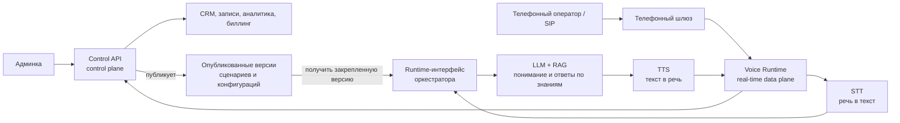
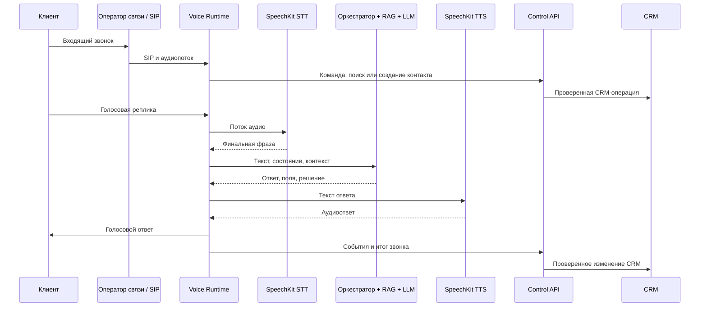

# Архитектурная справка: «Линия AI»

## 1. Назначение платформы

«Линия AI» - единая платформа для голосовой автоматизации продаж, контакт-центров и сервисных подразделений. Она объединяет три продукта в одном технологическом контуре:

1. **AI-анализ звонков** - расшифровка, оценка качества, поиск рисков, итогов и следующих действий по состоявшимся разговорам.
2. **Голосовой AI-менеджер для входящих** - прием входящих звонков, консультация по базе знаний, сбор данных и перевод на сотрудника.
3. **AI-автообзвон для исходящих** - запуск кампаний, автоматический дозвон, голосовой сценарий, квалификация лидов и передача результатов в CRM.

Общими для всех трех направлений являются: CRM, база знаний, сценарии, телефония, учет расходов, аналитика, роли пользователей и административная панель. Платформа не передает секреты, токены доступа или учетные данные в браузер; конфиденциальные операции выполняются на серверной стороне.

## 2. Принцип построения

Платформа построена по модульному принципу. Телефония, голосовой runtime, AI-логика, CRM и интерфейс разделены, но обмениваются событиями через защищенный API (программный интерфейс взаимодействия сервисов).



**Телефонный шлюз** принимает SIP/RTP (стандарты телефонной сигнализации и передачи голоса). **Voice Runtime** ведет конкретный звонок в реальном времени. **Диалоговый оркестратор** решает, на каком этапе сценария находится разговор, какие поля необходимо собрать и когда переводить человека на сотрудника. **LLM** (языковая модель) формирует ответ, а **RAG** (поиск ответа по корпоративным документам) предоставляет подтвержденный контекст из базы знаний; итоговый ответ дополнительно проходит бизнес-правила и проверку источников.

## 3. Основные компоненты

### 3.1. Административная панель

Веб-интерфейс используется руководителями, операторами, менеджерами и администраторами. В нем доступны:

- рабочий стол с ключевыми показателями: звонки, дозвон, конверсия, стоимость, статусы кампаний;
- создание входящих и исходящих сценариев;
- запуск, остановка и планирование обзвонных кампаний;
- импорт и проверка базы контактов;
- карточки звонков с аудио, транскрибацией, итогом и AI-рекомендациями;
- встроенная CRM-воронка, карточки лидов и история взаимодействий;
- настройка базы знаний, ролей, интеграций и лимитов;
- финансовый раздел с расходами по минутам, кампаниям, отделам и AI-профилям.

Live Dashboard (диспетчерская в реальном времени) через WebSocket/SSE показывает активные звонки, очереди, загрузку операторов, длительность, текущий этап сценария, handoff, технические предупреждения и прогноз расхода. Данные обновляются событиями, а не постоянным опросом API.

После передачи звонка человеку включается Agent Assist/Co-pilot: оператор видит live-транскрипцию, краткое резюме, намерение, тональность, обязательные поля, релевантные источники знаний и рекомендуемый следующий вопрос. Подсказки не выполняют действий автоматически; сотрудник принимает окончательное решение и может исправить AI-результат.

Доступ разграничен по ролям: владелец, администратор, руководитель, оператор, менеджер, аналитик. Для каждой роли настраивается перечень доступных разделов и действий.

### 3.2. Control API и прикладной backend

Control API - центральный серверный слой. Он хранит бизнес-состояние и управляет всеми процессами, но не совершает SIP-звонки напрямую. Его задачи:

- управление пользователями, организациями и правами;
- управление лидами, контактами, кампаниями и сценариями;
- прием событий телефонии и голосового runtime;
- создание задач в очереди;
- сохранение результатов звонков, транскрипций и метрик;
- выдача данных в административную панель;
- формирование интеграционных webhook (серверных уведомлений во внешние системы).

Backend использует PostgreSQL как основное хранилище бизнес-данных и Redis/BullMQ как очередь задач. Очередь обеспечивает управляемую повторную доставку задач при кратковременных ошибках оператора, перезапуске сервиса или всплеске нагрузки. Все обработчики задач идемпотентны (безопасны при повторном выполнении), а необработанные после лимита попыток задачи помещаются в DLQ (очередь ошибок) для разбора и контролируемого повтора.

### 3.3. Телефония и медиа-шлюз

Платформа работает с виртуальными АТС, SIP-провайдерами и облачными операторами связи. Поддерживается MANGO OFFICE, а также другие операторы, предоставляющие SIP-транк или API управления звонками.

Телефонный слой включает:

- SIP-транк - защищенное подключение к оператору связи;
- Asterisk или совместимый SBC/B2BUA (сервер управления телефонными сессиями);
- RTP-мост - прием и отправка голосового потока;
- запись звонка, предпочтительно в двухканальном виде: отдельно клиент и отдельно AI/оператор;
- перевод звонка на сотрудника, очередь операторов и сценарии недоступности;
- вебхуки по состояниям звонка: вызов, ответ, разговор, перевод, завершение, ошибка.

Телефонный слой не хранит CRM-данные и не принимает бизнес-решения. Он отвечает только за надежное соединение с оператором и передачу аудио.

### 3.4. Voice Runtime

Voice Runtime - сервис реального времени, который управляет жизненным циклом одного звонка. Для каждой сессии он:

- получает аудио клиента из телефонной линии;
- преобразует его в нужный для распознавания формат;
- отправляет поток в STT;
- получает промежуточные и финальные фразы;
- передает финальные фразы в диалоговый оркестратор;
- получает текстовый ответ;
- синтезирует голосовой ответ через TTS;
- возвращает аудио в телефонную линию;
- фиксирует задержки, ошибки, перебивания и технические метрики.

Перед STT применяется Audio Pre-processor (предобработка аудио): проверка кодека, ресемплинг, нормализация уровня, VAD (обнаружение речи), подавление устойчивого шума и эха, когда это не ухудшает телефонное аудио. DTMF, переданный через RFC 4733 или SIP INFO, принимается как отдельное событие IVR; in-band DTMF (тон внутри аудио) при необходимости детектируется и исключается из STT-потока. Исходная запись сохраняется отдельно от обработанного потока, поэтому аналитика и аудит могут сверить результат с первичным разговором.

Поддерживается **barge-in** (перебивание): если клиент начал говорить во время ответа AI, Voice Runtime отменяет текущий синтез, очищает очередь воспроизведения и прекращает отправку аудио AI в RTP-канал, не завершая сам телефонный вызов. Система переключается на речь клиента. Это необходимо для естественного разговора и сокращения пауз.

### 3.5. Распознавание и синтез речи

Для русского голосового контура применяются сервисы Yandex SpeechKit:

- **STT, Speech-to-Text** - потоковое преобразование речи клиента в текст;
- **TTS, Text-to-Speech** - потоковый синтез текстового ответа в голос;
- настройка словаря, нормализации номеров, пунктуации и отраслевых терминов;
- настройка голоса, скорости, пауз и интонации;
- контроль конца реплики клиента через EOU (определение окончания высказывания).

Для других языков голосовой провайдер выбирается отдельно. Платформа изолирует TTS/STT в адаптере, поэтому возможно подключение регионального провайдера, Azure Speech, ElevenLabs или локального движка без изменения CRM, сценариев и интерфейса.

### 3.6. Диалоговый оркестратор

Диалоговый оркестратор - слой, который соединяет голосовой канал с бизнес-логикой. Он работает как FSM (конечный автомат состояний): разговор проходит через явно определенные этапы, например приветствие, выявление потребности, сбор контакта, предложение, согласование следующего шага и завершение.

Он выполняет следующие функции:

- определяет текущий этап разговора;
- проверяет обязательные поля: имя, телефон, услуга, город, время, комментарий;
- использует намерения клиента: интерес, отказ, просьба перезвонить, перевод на человека, вопрос по продукту;
- применяет правила эскалации;
- ограничивает темы, которые AI может обсуждать;
- формирует структурированный результат каждого хода и звонка;
- передает в LLM только нужный контекст, чтобы снижать стоимость и не перегружать модель.

Для длинных диалогов применяется sliding window summarization (скользящее окно контекста): размер окна определяется token budget (доступным бюджетом контекста модели), а не фиксированным количеством реплик. Последние релевантные ходы передаются полностью, ранние части разговора сжимаются в структурированное резюме. Обязательные поля, согласия, обещания, решения и незавершенные действия хранятся отдельно в FSM-состоянии и не зависят от свободного резюме. Это не дает превысить контекстное окно модели, но сохраняет смысл разговора и историю обязательств.

LLM не получает право произвольно менять статус лида, запускать звонки или выполнять внешние действия. Все критичные операции проходят через правила оркестратора и серверные функции.

### 3.7. LLM и RAG

LLM - языковая модель, которая понимает свободную речь и формирует естественные ответы. RAG (Retrieval-Augmented Generation, генерация ответа с поиском по базе знаний) добавляет в запрос к LLM найденные фрагменты корпоративных материалов.

База знаний принимает:

- PDF, DOCX, TXT, Markdown, HTML;
- таблицы CSV/XLSX;
- FAQ, инструкции, скрипты, прайс-листы и регламенты;
- карточки услуг, врачей, товаров, филиалов, сотрудников и акций;
- ручные заметки и правила, запрещающие или разрешающие определенные формулировки.

Процесс работы RAG:

1. Документ извлекается и разбивается на смысловые фрагменты.
2. Для фрагментов создаются embeddings (числовые представления смысла текста).
3. Векторы сохраняются в поисковом индексе вместе с источником, датой и правами доступа.
4. При вопросе клиента система применяет ACL (права доступа) до поиска и находит релевантные фрагменты только разрешенной версии знаний.
5. В LLM передаются только найденные фрагменты, правила сценария и краткая история диалога.
6. Ответ проходит guardrails (проверки допустимости): модель не должна выдумывать цены, медицинские рекомендации, условия договора или обещания, которых нет в знаниях.
7. Если релевантный подтвержденный источник не найден, устарел, противоречит другому источнику или его уверенность ниже калиброванного порога, система не генерирует фактический ответ: предлагает передать вопрос сотруднику или оформить обратный звонок.

Для критичных действий и фактов используются не свободные текстовые ответы, а структурированные серверные команды с JSON Schema (схемой допустимых полей). Например, запись, перевод на сотрудника, изменение CRM-статуса, обещание цены или создание задачи выполняются только после проверки типа действия, источника, прав и параметров на сервере. Документы базы знаний и транскрипции считаются недоверенным контентом: они передаются LLM в изолированном поле, не могут изменять системные инструкции и не получают права вызывать инструменты.

Динамические факты - цены, остатки, свободные слоты, статус заказа и расписание - не берутся из текстового RAG, если есть структурированная система-источник. Оркестратор вызывает разрешенную серверную функцию и получает актуальное значение из CRM, календаря, МИС или товарной системы. Уверенность RAG калибруется на эталонном наборе вопросов и контролируется по версии базы знаний.

Для повторяющихся неизменяемых FAQ применяется semantic cache (кэш ответов по смысловой близости). Ключ кэша включает tenant, язык, сценарий, канал, филиал/регион, аудиторию и разрешения, версии базы знаний, промпта и policy/guardrails. Кэш инвалидируется при публикации новой версии знаний или изменении прав. Повторное использование допускается только при высоком калиброванном пороге близости, повторной policy-проверке и наличии сохраненных citations (источников); персональные, финансовые и динамические ответы не кэшируются. Регрессионные тесты содержат близкие по смыслу, но разные вопросы, чтобы исключить ошибочные совпадения.

### 3.8. Модель состояний, версии и идемпотентность

В системе раздельно ведутся состояния телефонной попытки, звонка, участия контакта в кампании, лида, задачи и доставки интеграционного события. Технический результат (например, «нет ответа»), бизнес-результат («заинтересован») и следующее действие («перезвонить») не смешиваются в одном статусе.

| Ось состояния | Примеры |
|---|---|
| Call attempt (результат попытки) | answered, busy, no_answer, voicemail, technical_error |
| Conversation outcome (итог диалога) | interested, refused, qualified, unknown |
| Handoff result (результат передачи) | not_required, queued, connected, failed |
| Next action (следующее действие) | none, callback, meeting, manual_review |
| Campaign membership (участие в кампании) | active, paused, suppressed, completed |

Каждая команда, способная вызвать внешний эффект, получает idempotency key (уникальный ключ безопасного повтора): инициирование вызова, создание лида, бронирование, отправка webhook, изменение статуса, запись расхода. Композитное уникальное ограничение `tenant + operation + idempotency key`, атомарно сохраненный результат и возврат ранее записанного результата позволяют обработчику обнаружить повтор без повторного внешнего эффекта. Исходящие события публикуются через transactional outbox (транзакционный журнал отправки), входящие - через inbox/deduplication (журнал приема и устранения дублей); ключи имеют контролируемый срок хранения.

Каждый звонок фиксирует снимок использованной конфигурации: версию сценария, промпта, базы знаний, модели, голоса, правил и схемы результата. Новая версия базы знаний строится в отдельном поисковом индексе, проходит проверку полноты и только затем публикуется атомарным переключением alias (указателя на активный индекс). Активные звонки продолжают использовать закрепленную версию до завершения; старая версия удаляется после безопасного периода.

Смена LLM, TTS-голоса или параметров синтеза проходит через canary-релиз: traffic split (контролируемое распределение новых сессий) сначала направляет небольшую долю новых звонков на новую конфигурацию. Активные звонки не переключаются посередине диалога и сохраняют закрепленную модель/голос до завершения.

### 3.9. Конструктор и симулятор сценариев

Сценарий хранится как версионный JSON/DSL (структурированное описание логики, пригодное и для машины, и для интерфейса), а не как единый неуправляемый промпт. Он состоит из узлов: приветствие, вопрос, извлечение поля, условие, ветвление, обращение к базе знаний, действие CRM, перевод сотруднику, повторный звонок, завершение и безопасный fallback.

Визуальный редактор позволяет бизнес-пользователю собирать сценарий в виде схемы, но перед публикацией система выполняет техническую проверку: нет ли недостижимых узлов, бесконечных циклов, отсутствующих обязательных полей, неподтвержденных действий или переходов без fallback. Каждый сценарий проходит состояния draft (черновик), review (проверка), published (опубликован), archived (архив) и имеет rollback (возврат к предыдущей версии).

Перед выпуском используется sandbox (песочница):

- текстовый симулятор - сотрудник вводит реплики клиента и видит ход FSM, найденные источники RAG, структурированный ответ и CRM-действия;
- аудиосимулятор - загружается тестовая запись, проверяются STT, EOU, распознавание полей и итог диалога;
- регрессионный набор - библиотека типовых и сложных диалогов, которая автоматически проверяется при изменении сценария, промпта, базы знаний или модели;
- canary-запуск - новая версия сначала используется на небольшой контролируемой доле звонков.

### 3.10. Идентификация, организации и доступы

Платформа поддерживает multitenancy (работу нескольких организаций в одном продукте) и выделенные контуры для клиентов с повышенными требованиями. У каждой организации есть собственные контакты, записи, сценарии, базы знаний, номера, кампании, бюджеты, интеграции и правила хранения.

Права строятся не только на ролях, но и на разрешениях: отдельно контролируются прослушивание записи, просмотр полного номера, экспорт, удаление, запуск массовой кампании, редактирование сценария, публикация базы знаний, доступ к финансам и настройка интеграций. Для опасных действий применяется approval workflow (двухэтапное согласование): например, одна роль готовит кампанию, а другая подтверждает ее запуск.

Для корпоративных заказчиков доступны MFA (вход с дополнительным фактором), SSO (единый вход через корпоративный провайдер), SCIM (автоматическое создание и отключение сотрудников), IP allowlist (доступ только из разрешенных сетей), SIEM export (выгрузка событий безопасности) и BYOK/KMS (управление собственными ключами шифрования).

## 4. Продуктовый контур 1: AI-анализ звонков

Контур анализа обрабатывает записи состоявшихся разговоров - как звонки платформы, так и записи из внешней телефонии или CRM.

Длинные внешние записи не анализируются внутри HTTP-запроса. Загрузка выполняется в объектное хранилище, после чего создается асинхронная задача со статусами `uploaded -> validating -> preprocessing -> transcribing -> analyzing -> completed/failed`. Worker (фоновый обработчик) выполняет обработку в очереди, а админка получает ход выполнения через WebSocket/SSE, уведомление или webhook. Это позволяет безопасно обрабатывать многочасовые файлы без таймаута браузера или API.

### Поток обработки

```text
Запись звонка -> транскрибация -> разделение реплик -> AI-анализ -> структурированный JSON -> карточка звонка / CRM / аналитика
```

Система формирует:

- полную транскрибацию с временными метками;
- разделение участников разговора;
- краткое резюме;
- выявленную потребность и итог;
- возражения, риски и обещания менеджера;
- чек-лист соблюдения сценария;
- оценку качества разговора;
- следующую рекомендацию менеджеру;
- поля для CRM: причина отказа, интерес, срок перезвона, ответственный, следующая задача.

Для внешних файлов применяется тот же Audio Pre-processor, что и в live-звонках: проверка контейнера и кодека, нормализация, ресемплинг, шумоподавление и при необходимости диаризация (разделение участников). Если оператор не предоставил двухканальную запись, результат диаризации получает confidence (уровень уверенности), который учитывается при оценке качества разговора. При confidence ниже калиброванного порога сегменты помечаются как `speaker_unknown`, а оценка качества использует агрегированные метрики разговора без ненадежной привязки реплики к роли.

Отдельно строится timeline (временная карта разговора): этапы сценария, намерения, возражения, тональность/напряжение с уровнем уверенности, точки ожидания, перебивания, handoff и влияние каждой реплики на итог. Тональность используется как вспомогательный сигнал для выбора эмпатичного сценария или передачи сотруднику, но не как автоматический вывод о личности клиента.

Сотрудник может исправить транскрибацию, итог, категорию возражения или оценку AI. Исправления проходят review и попадают в эталонный набор тестов, настройки сценария или базу знаний; система не переобучает модель автоматически на единичной правке.

Профили обработки позволяют выбирать баланс цены и глубины:

- **Эконом**: быстрое распознавание, сжатый анализ, минимальное число LLM-вызовов;
- **Качество**: расширенная оценка, детальный чек-лист, больше контекста и более сильная языковая модель.

## 5. Продуктовый контур 2: голосовой AI для входящих звонков

Входящий AI-менеджер отвечает на звонок, идентифицирует или создает клиента, ведет разговор по сценарию и при необходимости переводит вызов человеку.

### Поток входящего звонка



Входящий AI-менеджер способен:

- консультировать по базе знаний;
- квалифицировать клиента;
- собирать контактные данные;
- создавать лид и назначать ответственного;
- назначать перезвон или встречу;
- передавать звонок менеджеру по запросу клиента;
- автоматически передавать перспективные или сложные обращения человеку;
- сохранять запись, транскрибацию, резюме и действия в CRM.

Caller ID (номер входящего) используется только для поиска кандидата в CRM и не считается надежной аутентификацией. Если номер скрыт, пуст или имеет служебный формат, создается Anonymous Lead (временная анонимная сессионная сущность), привязанная к call session, но не постоянный контакт. Полноценная карточка контакта создается только после добровольного подтверждения имени и канала связи клиентом.

Триггеры перевода на человека настраиваются отдельно: прямой запрос клиента, низкая уверенность ответа, конфликт, VIP-клиент, сложный вопрос, юридическая/медицинская тема, высокая вероятность сделки, отсутствие свободного слота или превышение лимита диалога.

### Маршрутизация на сотрудника и очереди

Handoff (передача звонка человеку) использует skills-based routing (маршрутизацию по навыкам). Оркестратор выбирает не случайного свободного сотрудника, а подходящую очередь по тематике, языку, филиалу, региону, уровню квалификации, приоритету лида и графику работы. Например, вопрос о конкретной услуге переводится специалисту соответствующего направления, а VIP-клиент - в приоритетную очередь.

Поддерживаются warm transfer (сначала сотрудник получает контекст и подтверждает прием) и cold transfer (прямая передача в очередь). До соединения оператор видит краткое резюме, намерение клиента, собранные поля, использованные источники и предупреждения. Если сотрудник не ответил, система применяет настраиваемый сценарий: следующая очередь, обратный звонок, возврат к AI или корректное завершение. DTMF (нажатия клавиш телефона) используется для IVR, добавочных номеров и простого выбора пункта меню.

Во время разговора Voice Runtime различает barge-in (клиент начинает говорить во время ответа AI), double-talk (одновременная речь) и долгое молчание. При пересечении речи TTS приглушается или отменяется по политике сценария, overlap фиксируется в метриках, а при молчании система уточняет, остается ли клиент на линии, предлагает callback или завершает звонок.

## 6. Продуктовый контур 3: AI-автообзвон

Исходящий модуль предназначен для согласованных баз контактов и кампаний с контролем правил связи.

### Состав кампании

- база контактов с обязательным основанием согласия и журналом его происхождения;
- сценарий, цель, допустимые формулировки и список запретных тем;
- время обзвона, часовой пояс, дни работы и скорость дозвона;
- правила повторного звонка;
- лимиты параллельных линий и дневной бюджет;
- критерии статусов, передачи лида и остановки кампании.

Перед каждой попыткой набора, а не только при импорте базы, выполняется контроль: наличие и срок согласия, назначение согласия, локальное время контакта, глобальный DNC/suppression list (список запрета связи), исключение из кампании, количество предыдущих попыток, отсутствие параллельного звонка этому контакту и доступный бюджет. Отзыв согласия немедленно блокирует последующие попытки во всех кампаниях организации.

### Поток исходящего звонка

```text
Контакты -> проверка согласия и дедупликация -> очередь кампании -> dialer (модуль дозвона) -> SIP-оператор -> Voice Runtime -> сценарий / RAG / LLM -> CRM и аналитика
```

Система фиксирует результаты по независимым осям состояний: результат попытки (занято, нет ответа, автоответчик, техническая ошибка), результат диалога (интерес, отказ, квалифицирован), результат handoff, следующее действие и участие контакта в кампании. Это позволяет корректно описать ситуацию «клиент заинтересован, но перевод сотруднику не состоялся: назначить перезвон», не смешивая ее с ошибкой линии.

AMD (Answering Machine Detection, определение автоответчика) использует сигнал оператора и/или голосовой классификатор до запуска основного сценария. Результат хранится с уровнем уверенности; при сомнении система не проговаривает длинный рекламный текст, а выбирает нейтральный сценарий или завершает попытку по правилам кампании.

Для массовых кампаний предусмотрены ограничение скорости, приоритизация контактов, контроль количества попыток, паузы между попытками и автоматическая остановка при превышении лимита ошибок или бюджета. Бюджет резервируется атомарно до постановки звонка в очередь, поэтому несколько параллельных workers не могут совместно превысить установленный лимит. Резерв проходит состояния `reserved -> consumed/released -> adjusted`; для уже активных звонков действует grace buffer (нерасходуемый запас), покрывающий округление тарифа оператора и не обрывающий разговор на середине фразы.

## 7. CRM и операционный контур

CRM встроена в платформу и может одновременно синхронизироваться с внешней системой, например Bitrix24, amoCRM или отраслевой CRM.

Основные сущности:

- контакт;
- компания;
- лид;
- сделка;
- кампания;
- звонок;
- задача и follow-up (следующее действие);
- сценарий;
- база знаний;
- расход AI и телефонии.

В карточке лида отображаются источник, текущий этап, ответственный, история всех звонков, транскрибации, записи, результаты AI, назначенные задачи и статусы согласий. Встроенная Kanban-воронка позволяет вести лид от первого контакта до сделки или отказа.

Интеграции используют webhook и API. При создании лида, завершении звонка, изменении статуса или переводе на сотрудника данные могут автоматически передаваться во внешнюю CRM, в мессенджер, календарь или внутреннюю систему заказчика.

## 8. Биллинг, аналитика и контроль себестоимости

Платформа ведет построчный учет затрат по каждому звонку. Для каждого события фиксируются:

- длительность телефонной сессии;
- объем распознанной речи;
- число и длина синтезированных реплик;
- выбранный AI-профиль;
- число токенов LLM;
- объем запросов к RAG;
- стоимость оператора связи;
- стоимость записи и хранения;
- итоговая расчетная себестоимость.

В аналитике доступны срезы по кампаниям, отделам, номерам, сотрудникам, сценариям, дням и источникам лидов. Можно сравнивать экономный и качественный профили, задавать бюджеты, получать уведомления о превышении лимита и оценивать ROI (окупаемость) по воронке.

ROI-калькулятор показывает прогноз и факт: стоимость минуты, стоимость квалифицированного лида, стоимость записи/встречи, экономию рабочего времени сотрудников, расходы на хранение и телефонию. Тарифные профили «Эконом», «Стандарт» и «Качество» задают разрешенные модели, лимиты контекста, голоса, глубину анализа и целевую себестоимость.

Финансовый учет ведется через immutable billing ledger (неизменяемый журнал начислений): исходная запись расхода не переписывается, а любая корректировка создается отдельной проводкой с причиной, источником и временем. Для каждого типа провайдера определены правила округления, валюта, сверка с внешним счетом и защита от двойного начисления при повторной доставке события.

## 9. Надежность и деградация сервисов

Для каждого внешнего сервиса определены таймаут, число повторов, circuit breaker (предохранитель от каскадных ошибок), журнал инцидента и безопасное поведение для клиента. Если STT, TTS, LLM, RAG, CRM или оператор связи недоступны, система не оставляет клиента в тишине: воспроизводит короткую нейтральную реплику, переводит на доступного сотрудника, принимает заявку на обратный звонок либо корректно завершает вызов с фиксацией причины.

Активная SIP/RTP-сессия закрепляется за конкретным медиа-узлом. При падении узла платформа гарантирует сохранение уже зафиксированных событий и отсутствие повторного бизнес-действия, но не обещает бесшовно перенести уже идущий аудиозвонок на другой узел без специального медиа-сервера. Для масштабирования используются health checks (проверки здоровья), резервирование телефонного слоя, DLQ, runbook (инструкции дежурной команды), резервные копии и регулярное тестирование восстановления.

При плановом обновлении Voice Runtime используется graceful shutdown (мягкое завершение): экземпляр перестает принимать новые звонки, публикует статус draining, по умолчанию завершает активные сессии на текущем узле в пределах настраиваемого окна, сохраняет финальные события и только затем останавливается. Миграция или handoff активной медиасессии применяется лишь при явно поддерживаемом телефонном и медийном контуре. При полной потере media/call leg перевод активного вызова может быть невозможен; звонок завершается с технической причиной, а лид получает задачу на обратный контакт.

HA/DR (High Availability / Disaster Recovery, высокая доступность и аварийное восстановление) включает как минимум два уровня:

- **доступность сервисов**: несколько экземпляров API и workers, мониторинг, readiness/liveness checks, балансировка новых сессий, резервирование очереди и базы данных;
- **восстановление данных**: резервные копии, проверка восстановления, зафиксированные RPO (допустимая потеря данных) и RTO (целевое время восстановления), аварийные инструкции и учебные восстановления.

Провайдер речи подключается через адаптер. Основным остается выбранный по качеству и юридическим условиям сервис, а резервный провайдер применяется только после заранее утвержденных тестов языка, голоса, задержки и обработки персональных данных. При невозможности безопасно переключиться система выбирает честный fallback на человека, а не ухудшает разговор непроверенной технологией.

Для новых сценариев, голосов, моделей и конфигураций доступны A/B-тесты: аудитория делится на контролируемые группы, фиксируются версии, конверсия, длительность, качество, доля переводов, ошибки и стоимость. Победитель определяется по заранее заданным метрикам, а не по субъективному впечатлению.

Capacity planning (планирование мощности) выполняется нагрузочными тестами на выбранном кодеке, операторе, STT/TTS, модели и профиле диалога. Отчет фиксирует длительность и распределение звонков, проверенную параллельность, CPU/RAM, частоту перебиваний и double-talk, кодек, packet loss/jitter, число LLM-вызовов в минуту, длину контекста, RAG hit rate, режим TTS, лимиты внешних провайдеров, p50/p95/p99 задержек, долю fallback и стоимость на пиковой нагрузке. Горизонтальные экземпляры добавляются до достижения заранее установленного порога нагрузки; числовая вместимость не декларируется до подтверждения тестовым отчетом.

Архитектурная цель, лабораторное измерение и доказанная production-нагрузка не смешиваются. Для каждой поставки ведется отдельная матрица валидации:

| Показатель | Статус валидации | Результат / ссылка на отчет |
|---|---|---|
| Максимальная параллельность | capacity test обязателен до запуска | значение из отчета |
| p95 начала ответа | лабораторный и операторский тест | значение и профиль нагрузки |
| Barge-in p95 | тест перебиваний | значение и число кейсов |
| DR-восстановление | регулярные учения | дата, RPO/RTO-факт |
| Production uptime | только при наличии production-выборки | период и фактическая доступность |

## 10. Хранение данных и безопасность

Архитектура предусматривает разделение данных по назначению:

- PostgreSQL - CRM, статусы, сценарии, пользователи, аудит и финансовые события;
- Redis Cache - краткоживущий кэш, потеря которого не влияет на бизнес-состояние;
- Redis Queue - персистентная очередь с failover (переключением при отказе), запретом eviction (вытеснения данных) и контролируемым восстановлением;
- Redis Locks - кратковременные блокировки с TTL и fencing token (маркером, запрещающим устаревшему процессу менять данные);
- Object Storage - аудиозаписи, документы базы знаний, экспортные файлы;
- векторный индекс - embeddings и метаданные фрагментов знаний;
- журнал аудита - входы, изменение настроек, запуск кампаний, экспорт и операции с персональными данными.

Для SaaS-режима tenant context (контекст организации) определяется сервером из аутентифицированной сессии и membership (членства пользователя в организации), а не из произвольного поля клиентского запроса. Изоляция организации применяется в PostgreSQL, Redis, очередях, объектном хранилище, векторном индексе, кэше, логах и экспортных файлах. RLS-контекст устанавливает backend; сервисные вызовы используют подписанную service identity, а фоновые jobs содержат неизменяемый tenant snapshot, проверяемый перед исполнением.

Применяются следующие меры:

- шифрование трафика между браузером, API, телефонией и AI-сервисами;
- хранение секретов в Secret Manager/Vault с ротацией и аудитом чтения; переменные окружения используются только как контролируемый способ доставки в процесс;
- разграничение прав доступа по ролям;
- гранулярные разрешения на прослушивание записи, экспорт, запуск кампании, изменение сценария, просмотр финансов и настройку интеграций;
- короткоживущие сессии и серверная проверка полномочий;
- запрет на передачу технических ключей в клиентский интерфейс;
- ограничение доступа к аудиозаписям и экспортам;
- политики срока хранения и удаления записей;
- аудит критичных действий.

HTTP/API-контур защищается через API Gateway/WAF (межсетевой экран веб-приложений), rate limiting (лимиты по IP, пользователю, tenant и операции), проверку схемы запроса, service-to-service authentication, CSP (политику безопасности содержимого админки), CSRF-защиту cookie-сессий, отзыв сессий и контроль загрузки файлов. Документы базы знаний проверяются на тип, размер, вредоносное содержимое и допустимое происхождение. Журнал аудита имеет tamper-evident protection (контроль попыток незаметно изменить историю).

Телефонный контур использует SIP TLS/SRTP при поддержке оператора, ограничения IP-адресов и направлений, лимиты стоимости и длительности звонка, защиту от toll fraud (несанкционированного использования платной телефонии), контроль Caller ID и журналирование административных операций телефонного шлюза.

Жизненный цикл данных управляется политикой организации: аудио, транскрипции, AI-резюме, документы, embeddings, кэш, выгрузки, логи и резервные копии получают срок хранения, статус удаления и подтверждение завершения. Для критичных случаев поддерживается legal hold (запрет удаления по юридическому основанию). В технических логах персональные данные маскируются, а аудиозаписи и полные транскрибации не записываются в диагностические сообщения.

Retention engine (сервис жизненного цикла данных) по расписанию переводит записи между классами хранения, удаляет просроченные данные и ведет audit trail (историю удаления). Удаление распространяется на первичный файл, транскрипцию, извлеченные поля, RAG-индекс, временные файлы, кэш, выгрузки и задачи синхронизации. Для внешних CRM и хранилищ создается подтверждаемое задание на удаление, а не только локальная отметка в базе. Обработанное диагностическое аудио имеет отдельную, обычно более короткую retention policy; после завершения контроля качества оно удаляется, если не требуется договором.

Резервные копии имеют отдельный срок хранения и не редактируются точечно. Для выполнения права на удаление применяются crypto-erasure (уничтожение отдельного ключа шифрования), tombstone (неизменяемая отметка об удалении) и повторное применение политики после восстановления backup; удаленный объект не должен вернуться в рабочий контур при аварийном восстановлении.

Для медицинских, финансовых и других чувствительных отраслей правила хранения, уведомления о записи разговора, согласия и трансграничная передача данных настраиваются в соответствии с требованиями заказчика и применимым законодательством.

Для российского контура персональные данные, PostgreSQL, векторный индекс, записи и объектное хранилище размещаются в дата-центрах на территории РФ. При работе в иных юрисдикциях применяется отдельная политика data residency (географического размещения и обработки данных).

## 11. Развертывание

Платформа поддерживает гибридную схему развертывания:

- веб-интерфейс и статические материалы - на Vercel для контуров без обработки ПДн в edge/CDN либо в локальной инфраструктуре заказчика для российского и чувствительного контура;
- Control API, очередь, голосовой runtime и телефонный шлюз - на выделенных виртуальных машинах, Kubernetes или в Yandex Cloud;
- Yandex SpeechKit, Yandex AI Studio и Object Storage - в отдельном облачном каталоге заказчика;
- SIP-транк - через оператора связи, с сетевыми ограничениями и разрешенными IP-адресами.

```text
Control plane: Пользователь -> HTTPS -> Админка -> Control API -> PostgreSQL / Redis / Object Storage
                                                       |
                                                       +-> Административные настройки оркестратора

Real-time data plane: Оператор связи <-> SIP-транк <-> Asterisk/SBC <-> Voice Runtime
                                                                           |
                                                                           +-> Runtime API оркестратора -> SpeechKit / LLM / RAG
                                                                           |
                                                                           +-> События/команды -> Control API
```

Такое разделение позволяет масштабировать голосовые линии независимо от веб-интерфейса и CRM. При росте нагрузки добавляются экземпляры voice runtime и workers (фоновые обработчики), а очередь распределяет кампании между ними. Стратегия партиционирования PostgreSQL выбирается по фактическому профилю нагрузки: для крупных таблиц используются временное, hash- или комбинированное партиционирование без создания отдельного раздела для каждого небольшого tenant. При росте аналитической нагрузки события реплицируются в OLAP-хранилище (например, ClickHouse), не замедляя CRM.

Инфраструктура управляется как код через Terraform и GitOps-процесс. CI/CD выполняет тесты, security scan, миграции, contract tests интеграций, staged deployment (поэтапную поставку), feature flags (включение функций без нового деплоя) и контролируемый rollback.

| Компонент | Целевой RPO | Целевой RTO | Допустимая деградация |
|---|---:|---:|---|
| PostgreSQL | до 5 минут | до 60 минут | временный read-only или остановка новых операций |
| Redis Queue | до 1 минуты | до 15 минут | остановка новых задач, без повторного внешнего эффекта |
| Object Storage | до 15 минут | до 60 минут | временная недоступность новой записи/экспорта |
| Voice Runtime | сохраненные события - до 5 секунд | до 10 минут для новых сессий | активная сессия может быть корректно завершена или передана человеку |

Цели RPO/RTO уточняются договором и проверяются регулярными учениями восстановления; они не подменяют фактический SLA конкретного облака или оператора связи.

## 12. Интеграционные точки

Платформа предоставляет следующие типы интеграций:

- SIP-транки и API операторов связи;
- внешние CRM и МИС (медицинские информационные системы);
- календарь и сервис записи;
- мессенджеры для передачи лидов;
- вебхуки о завершении звонка, переводе, создании лида и ошибках;
- импорт/экспорт CSV и XLSX;
- SSO (единый вход) при необходимости корпоративной интеграции;
- корпоративные базы знаний и файловые хранилища.

Для каждой интеграции определяются владелец данных (source of truth), сопоставление полей, правила разрешения конфликтов, направление синхронизации и допустимые операции удаления. Это исключает циклы вида «наша CRM обновила внешнюю CRM, а внешняя CRM повторно обновила нашу».

Webhook-события имеют версию, уникальный event_id, timestamp (время создания), key id, canonical serialization (однозначную сериализацию для проверки подписи), цифровую подпись и idempotency key. Получатель проверяет подпись, допустимое временное окно и повтор event_id; signing secret (ключ подписи) ротируется без остановки интеграции. Outbox фиксирует намерение отправить событие в одной транзакции с бизнес-операцией и позволяет надежно повторять доставку; inbox устраняет дубли на приеме, а интерфейс позволяет безопасно повторить доставку.

При временной ошибке доставка повторяется по расписанию с ограничением числа попыток и времени жизни. Недоставленное событие переводится в архив ошибок с TTL/aging, а не бесконечно занимает очередь; в CRM появляется статус `sync_error` и задача ответственному сотруднику. OpenAPI описывает синхронные методы, AsyncAPI - события и очереди, поэтому интеграции не зависят от неформальных договоренностей.

## 13. Контроль качества и эксплуатация

Для эксплуатации предусмотрены технические метрики:

- время ответа STT, LLM и TTS;
- задержка первого голосового ответа;
- длительность и причины завершения звонка;
- процент перебиваний и переводов на сотрудника;
- ошибки SIP, очереди и внешних API;
- качество распознавания и доля неуверенных ответов;
- стоимость минуты и стоимость квалифицированного лида.

Каждому звонку назначается correlation_id/call_id (единый идентификатор), который проходит через SIP, Voice Runtime, очередь, LLM, CRM, биллинг и webhook. Это позволяет восстановить полную цепочку обработки и быстро локализовать ошибку.

Для голосового качества контролируются codec (кодек), jitter (колебание задержки пакетов), packet loss (потеря пакетов), уровень сигнала, VAD/EOU, время остановки TTS при перебивании и задержка первого ответа. При наличии данных оператора рассчитывается MOS (оценка воспринимаемого качества связи). Низкое качество линии не маскируется увеличением громкости: AI просит повторить, предлагает перевод или фиксирует причину для аналитики.

SLO (целевые показатели сервиса) определяют проверяемое качество эксплуатации. Метрика начала ответа измеряется строго от `STT final received` до `first synthesized audio byte sent to RTP` (первый байт синтезированного аудио отправлен в телефонную линию). Базовые цели: остановка ответа AI после начала речи клиента - до 200-300 мс p95; начало ответа - до 1,2-1,5 секунд p95; отсутствие необъяснимой тишины дольше 2-3 секунд; отдельные p50/p95/p99, availability, error rate и доля fallback для входящих и исходящих линий. Точные значения подтверждаются нагрузочными тестами с выбранным оператором, провайдером речи и зафиксированным профилем нагрузки.

Error budget (допустимый запас ошибок) связывает SLO с эксплуатацией: при его исчерпании для компонента замораживаются рискованные релизы, включается расследование и приоритет получает стабильность. Полнота аудита критичных действий оформляется как security invariant (обязательное проверяемое правило безопасности), а не как метрика скорости.

Отдельный AI evaluation framework (контур оценки AI) хранит эталонные диалоги, ожидаемые статусы, обязательные поля, допустимые источники и ручные исправления сотрудников. Он измеряет точность классификаций, корректность RAG, соблюдение сценария, систематические ошибки и регрессии при обновлении модели. Replay звонка показывает таймлайн реплик, задержки STT/LLM/TTS, источники ответа, решения оркестратора и все внешние действия.

Система поддерживает тестовые номера, отдельные тестовые кампании, лимиты параллельных звонков, безопасный режим симуляции и поэтапный запуск: один номер -> малая группа -> ограниченная кампания -> промышленный объем.

## 14. Результат для заказчика

Заказчик получает единый операционный контур, в котором можно:

- принять или инициировать звонок;
- понять намерение клиента;
- ответить голосом по проверенной базе знаний;
- собрать данные и передать звонок сотруднику;
- зафиксировать результат в CRM;
- проанализировать качество разговора;
- увидеть стоимость каждой минуты и каждого лида;
- масштабировать работу без замены основной архитектуры.

## Приложение A. Ключевые сущности данных

Для исключения неоднозначности продукт использует явную доменную модель:

- `Organization`, `User`, `Membership`, `RoleBinding`, `Permission` - организация, пользователь и права;
- `PhoneNumber`, `SipTrunk`, `Line`, `OperatorQueue`, `Skill` - телефонные ресурсы и маршрутизация;
- `CallSession`, `CallLeg`, `CallAttempt`, `Participant`, `Utterance`, `TranscriptSegment`, `Recording` - техническая модель разговора;
- `Contact`, `AnonymousLead`, `Lead`, `Deal`, `FollowUp`, `MeetingHold`, `MeetingBooking` - CRM и действия после разговора;
- `Campaign`, `CampaignMembership`, `ConsentRecord`, `SuppressionEntry`, `RetryPolicy` - исходящие кампании и право на связь;
- `ScenarioVersion`, `PromptConfiguration`, `ModelConfiguration`, `KnowledgeDocument`, `KnowledgeVersion`, `KnowledgeChunk` - управляемая AI-конфигурация;
- `ModelExecution`, `RagRetrieval`, `SourceCitation`, `Handoff`, `IntegrationDelivery` - решения AI и интеграционные эффекты;
- `BillingEntry`, `BudgetReservation`, `AuditEvent`, `DeletionJob`, `RetentionPolicy` - финансы, аудит и жизненный цикл данных.

Все сущности, относящиеся к клиентским данным, имеют tenant-boundary (принадлежность организации), время создания/изменения, автора изменения, версию и при необходимости ключ идемпотентности.

## Приложение B. Режимы поставки

**Базовый контур** включает голосовой runtime, SIP-интеграцию, STT/TTS, оркестратор, RAG, CRM, кампании, записи, аналитику, биллинг, симулятор и контроль согласий.

**Контур повышенной надежности** добавляет резервные медиа-узлы, multi-carrier SIP, расширенный HA/DR, резервного провайдера речи, OLAP, WAF/API Gateway и круглосуточное наблюдение.

**Enterprise-контур** добавляет SSO/SCIM/MFA, SIEM, BYOK/KMS, выделенную tenant-инфраструктуру, расширенные политики хранения, skills-based routing, Co-pilot, feature flags, A/B-тесты и интеграции с отраслевыми системами.

Состав конкретной поставки фиксируется договором, требованиями к данным, объемом звонков, языками, оператором связи и выбранными интеграциями.

Документ намеренно не содержит паролей, токенов, IP-адресов, идентификаторов облачных каталогов, реквизитов SIP-транков, схемы сети и иных сведений, которые могут использоваться для доступа к инфраструктуре.
